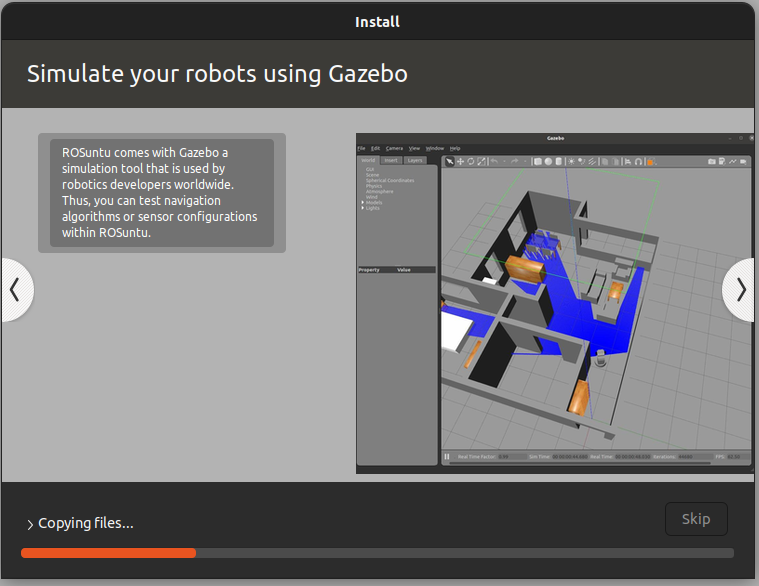

# ROSuntu

<div align="center">
    
</div>

## Table of Contents

1. [About ROSuntu](#about-rosuntu)
2. [Download ROSuntu](#download-rosuntu)
3. [Install ROSuntu](#install-rosuntu)
4. [Create ROSuntu](#create-rosuntu)

## About ROSuntu

This is the repository of ROSuntu, a Ubuntu-based distribution for ROS 2. ROSuntu is a distro of Ubuntu, which makes it easy enough for new users to go into it. Still, we gave it the customization for ROS 2 developers, including installing ROS 2, Gazebo, VSCode, Git, and Docker. This repository provides the materials and the guide to creating the ISO for the ROSuntu distro.

<div align="center">
  
  
  
</div>

## Download ROSuntu

<div align="center">
  <a href="https://drive.google.com/uc?export=download&id=1DGcXM7G_5m4QpoRxAOFpHdov-XRBRKut" download>
    
  </a>
</div>

<div align="center">
  <p style="margin-top: 20px;"><b>MD5</b>: <code>f012a0285a1873a451cf268aded2bb78</code></p>
</div>

## Install ROSuntu

The installation of ROSuntu is similar to a regular Ubuntu. Thus, you will have to select your keyboard layout and your timezone, choose between standard and minimal installation and create your user.

<details>
<summary>Click to expand</summary>

Take a look to the custom slideshow of ROSuntu that you will see during installation.

<div align="center">
  

  
  
  
  
  
  
</div>

</details>

## Create ROSuntu

ROSuntu has been created with Cubic. Here you have the steps to reproduce the ROSuntu distribution using Cubic and the materials of this repository.

<details>
<summary>Click to expand</summary>

### Cubic

Download and install [Cubic](https://github.com/PJ-Singh-001/Cubic). It runs on distributions based on Ubuntu 18.04.5 Bionic and above.

```shell
$ sudo apt-add-repository universe
$ sudo apt-add-repository ppa:cubic-wizard/release
$ sudo apt update
$ sudo apt install --no-install-recommends cubic
```

### Start Page

Open Cubic in your workspace for instance, in a directory called rosuntu:

```shell
$ mkdir ~/rosuntu
$ cd ~/rosuntu
$ cubic .
```

### Project Page

Download the [Ubuntu 22.04.4 LTS (Jammy Jellyfish)](https://releases.ubuntu.com/jammy/) ISO and load it in the Project Page of Cubic. Modify the custom data by replacing Ubuntu with ROSuntun and setting the release to Humble Hawksbill.

### Terminal Page

Clone this repository in the chroot terminal and run the install script to install all packages. Use all of the materials in this repository. Note the kernel shown at the end.

```shell
$ git clone https://github.com/mgonzs13/rosuntu
$ cd rosuntu
$ git checkout 22-humble-desktop
$ ./install.sh
```

After installing everything, remove this repository.

```shell
$ cd ..
$ rm -rf rosuntu
```

### Prepare Page

Wait until everything is prepared...

### Packages Page

Mark the packages that you want to exclude in the standard and the minimal installation. In the case of ROSuntu, everything is left by default.

### Options Page

Select the kernel shown at the end of the installation on the Terminal Page. Then, copy the content of the [grub.cfg](./boot/grub.cfg) and [loopback.cfg](./boot/loopback.cfg) in the boot tag.

### Compression Page

Select the compression. For the case of ROSuntu, we have selected xz.

### Generate Page

Wait until the ISO is created...

### Finish Page

Congrats, you have created the ROSuntu ISO. You can test it now.

</details>
